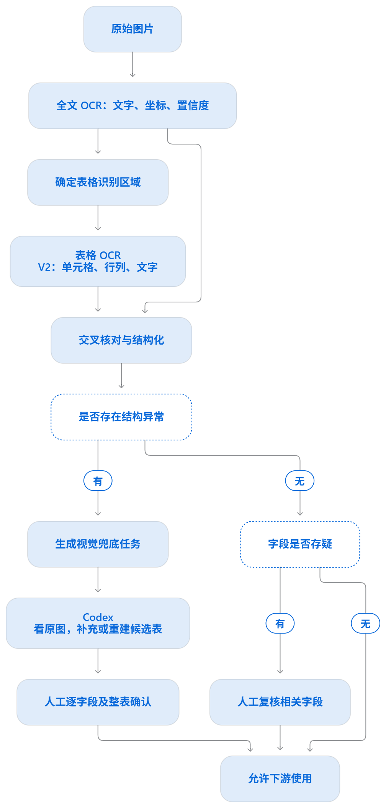

# 双路 OCR、视觉候选与人工复核

本文件是 `SKILL.md` 的 OCR 分支操作说明。当前只提取包装事实，不做营养计算或合规判定。



## 运行与分流

```powershell
python -m src.main --image '包装图.png' --output structured.json --review-output review.json --vision-task-output vision-tasks.json --accurate-raw-output accurate_raw.json --table-v2-raw-output table_v2_raw.json
```

实时流程先调用百度高精度全文 OCR，再调用表格文字识别 V2；大图优先裁出营养表，V2 坐标会换算回原图。两路原始返回分别保存，不能用视觉候选或人工改写原始 OCR。离线复现时给 `--ocr-json` 和 `--table-v2-json`；单给 `--ocr-json` 是旧单路模式。

- 全文 OCR 某行分数 `<0.96` 或缺分数：所引用的字段必须人工复核。即使 V2 文字一致也不跳过。
- V2 没有同类分数；只有同位置、同内容的高分全文 OCR 行可使其单元格自动 `ready`。其余字段为 `needs_review`。
- `tableDiagnostics.status=needs_vision`：表头混入数据、营养素与单位不符、漏行、零行或 V2 不可用。即使个别数字高分，也不得据此计算；先由当前 Codex Skill 查看原图并提出整表候选。
- `tableDiagnostics.status=ok` 且各字段 `ready`：下游仍须经 `gate_nutrition_table` 放行。

## Codex Skill 看图后的候选交接

读取 `vision-tasks.json`、`structured.json` 和**原始图片**，放大任务中的 `boxPx` 区域。逐行记录营养素、印刷含量、印刷 NRV% 和表头基准；对照两路 OCR 的 `evidence.id`。原图读不清的内容留给人工，不能按法规常见值、上下行顺序或其他包装猜测。`codex_vision` 只是候选来源，没有 OCR 置信度；其位置最多表示整张表区域，不伪造字级坐标。

把候选保存为单独 JSON。例如（真实文件必须包含原图中**全部**可见行）：

```json
{
  "schemaVersion": "1.0",
  "documentId": "m2-front",
  "imageName": "M2-包装设计稿正面.png",
  "imageSha256": "原图文件的64位小写SHA-256",
  "tables": [
    {
      "tableId": "table:1",
      "basis": {
        "kind": "per_serving",
        "raw": "每份43克(g)",
        "value": "per_serving",
        "servingSize": {"raw": "43克(g)", "value": "43", "unit": "g"}
      },
      "rows": [
        {
          "nutrient": {"raw": "能量", "value": "energy"},
          "amount": {"raw": "822千焦(kJ)", "value": "822", "unit": "kJ"},
          "nrvPercent": {"raw": "10%", "value": "10", "unit": "%"}
        }
      ]
    }
  ]
}
```

`supportingEvidenceRefs` 可选，仅填确实对应的原有 OCR 证据 ID。未印 NRV% 的行写 `"nrvPercent": null`。`basis.kind` 只能为 `per_serving`、`per_100g`、`per_100ml` 或 `unknown`；`per_serving` 必须写 `servingSize`。数字 `value` 统一为十进制字符串。提交候选前，检查行数与原图完全一致，特别注意跨行、合并单元格和脚注。

```powershell
python -m src.ocr.vision --document structured.json --image '包装图.png' --candidates vision-candidates.json --output vision-proposed.json
python -m src.review.page --document vision-proposed.json --image '包装图.png' --output review.html
```

导入后所有视觉候选字段仍是 `needs_review`。复核人对照原图逐字段确认或修正；若表格行、列、脚注都核对完整，再勾选复核页的整表确认。页面导出的决定 JSON 经 `src.review.apply` 校验图片 SHA-256、原值及证据引用，生成新 JSON；原始 OCR、初始结构化、视觉候选和人工决定文件都保留。只有字段和整表均确认，`tableDiagnostics` 才可变为 `HUMAN_REVIEWED_TABLE/ok`。

`src/shared/CONTRACT.md` 定义所有字段与状态；计算和数字核对模块须先调用 `gate_nutrition_table(document, table_id, check_id)`。若 Skill 无法可靠辨认某行，就保持 `needs_vision`，交给人直接看图，不制造候选结果。
